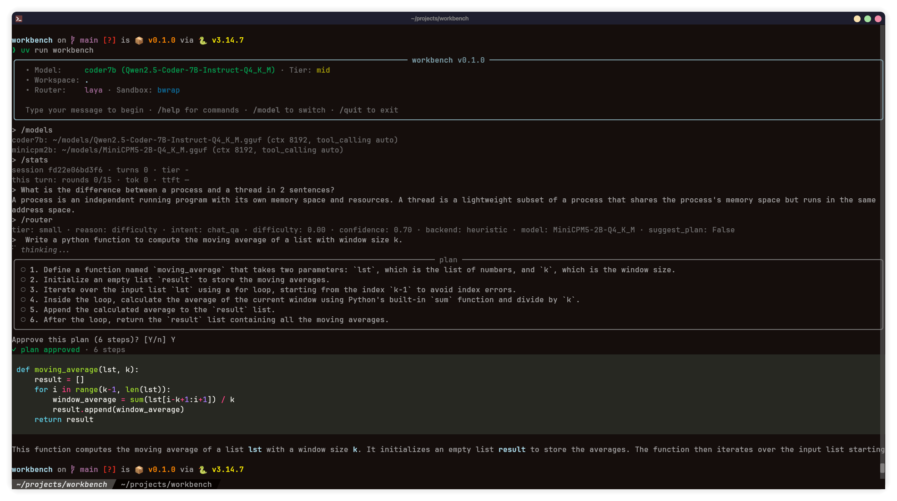
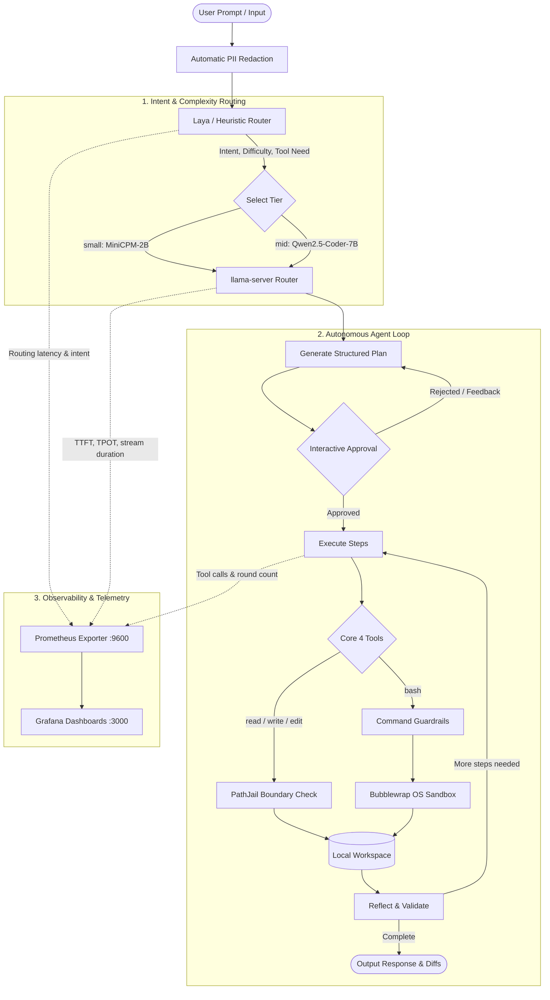
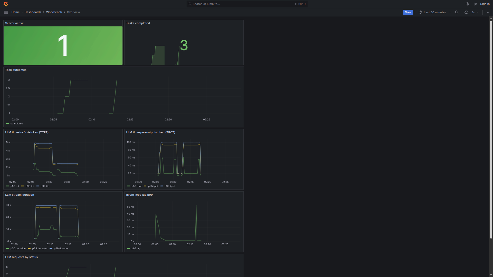

# Workbench

[](https://www.python.org/downloads/)
[](https://github.com/astral-sh/uv)
[](#1-key-principles--constraints)
[](#1-key-principles--constraints)
[](#6-local-observability-stack)
[](#9-testing--quality-assurance)
[](https://github.com/astral-sh/ruff)

A sovereign, strictly local AI workbench: an interactive terminal harness driving local models served by `llama.cpp`, with a fast local classifier (`laya`) deciding intent and model complexity per turn, running an autonomous **plan → approve → execute → reflect** agent loop over sandboxed tools, with first-class local observability and data governance.

---


*Figure 1: Workbench TUI showcasing dynamic model routing (`laya`), interactive multi-step plan generation and approval, and streaming code execution.*

---

## Table of Contents

- [1. Key Principles & Constraints](#1-key-principles--constraints)
- [2. Requirements & Installation](#2-requirements--installation)
- [3. Quickstart](#3-quickstart)
- [4. Interactive TUI & Slash Commands](#4-interactive-tui--slash-commands)
- [5. Architecture & Request Flow](#5-architecture--request-flow)
- [6. Local Observability Stack](#6-local-observability-stack)
- [7. Sovereign Governance & Local Knowledge](#7-sovereign-governance--local-knowledge)
- [8. Plugins & Extensibility](#8-plugins--extensibility)
- [9. Testing & Quality Assurance](#9-testing--quality-assurance)
- [10. Roadmap](#10-roadmap)

---

## 1. Key Principles & Constraints

1. **Strictly Offline Runtime:** Zero external API calls at runtime. All inference runs against localhost (`llama-server`). Network access is restricted exclusively to explicit `workbench models download` commands and the local Prometheus/Grafana containers. The runtime automatically enforces `HF_HUB_OFFLINE=1` and `TRANSFORMERS_OFFLINE=1` process-wide.
2. **llama.cpp Runtime via Router Mode:** Driven via `llama-serve --router --models-dir <store>`. A single server process manages loaded models; model switching is an in-request parameter rather than a process restart.
3. **Laya Intent & Complexity Routing:** Employs upstream PyTorch `laya` (ModernBERT-based) running natively on CUDA/CPU for fast (~30ms) batched intent classification, difficulty scoring (tiers: `small` vs `mid`), and tool requirement detection, backed by a deterministic heuristic router fallback.
4. **Interactive CLI & TUI Harness:** Terminal interface built with `agentic-tui` (Rich + `prompt_toolkit`), scrollback-preserving, with inline streaming markdown, diffs, live step progress, and slash commands. Also supports headless scriptable execution via `-p/--print` and `--json` event streaming.
5. **Core Four Tools:** Minimal and deterministic primitives: `read`, `write`, `edit`, and `bash`.
6. **Multi-layer Sandbox:** Path jail (workspace boundary enforcement) + `bubblewrap` (OS namespace isolation, private tmp, dropped caps, network unshared) + command guardrail policy with interactive approval for risky commands.
7. **Sovereignty & Governance:** Automated PII redaction on inputs, human-in-the-loop review queue for sensitive actions, local document indexing, and runtime sovereignty auditing.
8. **Local Observability:** Pre-configured Prometheus and Grafana dashboards as code (`workbench obs up/down`) scraping latency, routing decisions, TTFT, TPOT, token throughput, and llama-server internals.
9. **Pluggable Architecture:** Extension points for custom tools (`workbench.tools`), routers (`workbench.routers`), model providers (`workbench.providers`), sandboxes (`workbench.sandboxes`), and TUI slash commands (`workbench.commands`), loaded via Python entry points or `~/.config/workbench/plugins/*.py`.

---

## 2. Requirements & Installation

### System Requirements

- **Linux x86_64** (kernel with unprivileged user namespaces enabled for Bubblewrap)
- **Python >= 3.14**
- **uv** package manager
- **bubblewrap** (`bwrap`) >= 0.8
- **llama.cpp** (`llama-server` / `llama-serve` wrapper on `PATH` or in `~/.local/bin`)
- **Docker** (optional, required for local Prometheus/Grafana observability stack)

### Installation

```bash
# Clone the repository
git clone https://github.com/Ojas025/Sovereign.git workbench
cd workbench

# Install dependencies with uv
uv sync --group dev

# Verify installation
uv run workbench --help
```

---

## 3. Quickstart

### Step 1: Configure Models

Create a project configuration `.workbench.toml` (or user-level `~/.config/workbench/config.toml`):

```toml
[models]
search_paths = ["~/models", "~/.local/share/workbench/models"]

[models.profiles.minicpm2b]
path = "~/models/MiniCPM5-2B-Q4_K_M.gguf"
ctx_len = 8192
tool_calling = "auto"

[models.profiles.coder7b]
path = "~/models/Qwen2.5-Coder-7B-Instruct-Q4_K_M.gguf"
ctx_len = 8192
tool_calling = "auto"

[routing.tiers]
small = "minicpm2b"
mid = "coder7b"
```

### Step 2: Download Models & Warm Cache

Download models into your local store. This is the **only** workbench command that connects to external networks:

```bash
# Download a GGUF model from Hugging Face
uv run workbench models download hf:Qwen/Qwen2.5-Coder-7B-Instruct-GGUF/qwen2.5-coder-7b-instruct-q4_k_m.gguf

# Or pull via Ollama shim
uv run workbench models download ollama:qwen2.5-coder:7b

# Inspect store and configured profiles
uv run workbench models list
```

> **Note:** The download command also prefetches the `laya` classifier checkpoint so the entire runtime remains completely air-gapped and offline.

### Step 3: Launch the Interactive TUI

```bash
uv run workbench
```

Inside the TUI:
- Type your prompt. The router classifies intent and dynamically routes to the appropriate model tier (`small` vs `mid`).
- When planning is suggested, a numbered step plan is displayed for interactive approval (`[Y/n]` or feedback).
- File operations render inline syntax-highlighted unified diffs before being committed.
- Guardrails intercept risky shell commands and request explicit confirmation.

### Step 4: Headless Execution & Automation

Workbench can be run in headless mode for scripts, automation, and CI pipelines:

```bash
# Print response directly to stdout
uv run workbench -p "Write a python script in test.py that calculates fibonacci"

# Stream structured NDJSON events for external ingestion
uv run workbench -p "Explain quantum computing" --json
```

---

## 4. Interactive TUI & Slash Commands

Workbench provides a rich set of built-in slash commands in the interactive harness:

| Command | Usage | Description |
|---|---|---|
| `/model` | `/model [auto \| <tier> \| <profile>]` | Inspect current tier/model or manually pin a specific tier/profile |
| `/models` | `/models` | List all configured model profiles, context lengths, and paths |
| `/plan` | `/plan` | View active plan steps, statuses, and execution progress |
| `/router` | `/router` | Display detailed rationale, intent, difficulty, and confidence for the last route |
| `/stats` | `/stats` | View session metrics (rounds, token count, TTFT, turn duration) |
| `/review` | `/review [add <reason> <item> \| approve <id> \| reject <id>]` | Manage and resolve the human-in-the-loop governance review queue |
| `/knowledge` | `/knowledge [list \| add <file> \| search <query>]` | Index and perform deterministic local search over project files |
| `/sovereignty` | `/sovereignty` | Audit runtime offline policy (network isolation, local endpoint, proxy status) |
| `/sessions` | `/sessions` | List saved session IDs |
| `/resume` | `/resume [id]` | Resume a previous session by ID (or the most recent session if omitted) |
| `/clear` | `/clear` | Clear the terminal viewport |
| `/quit` | `/quit` or `/exit` | Exit the workbench |

---

## 5. Architecture & Request Flow

### Request Lifecycle



### Directory Structure

```
workbench/
├── assets/                     # Visual assets and dashboard screenshots
├── docker/
│   ├── observability/          # docker-compose.yml, prometheus.yml
│   └── grafana/                # Grafana provisioning & pre-built JSON dashboards
├── plugins/
│   └── examples/               # Reference plugin implementations for each extension point
├── scripts/                    # Utility scripts (demo features, benchmark runners)
├── src/workbench/
│   ├── cli.py                  # CLI dispatcher: TUI, -p/--print, --json, subcommands
│   ├── config.py               # Layered TOML config -> typed frozen Config model
│   ├── logging_setup.py        # Central JSONL rotating file + console logging
│   ├── core/
│   │   ├── registry.py         # Plugin discovery (entry points + ~/.config/workbench/plugins/*.py)
│   │   ├── bootstrap.py        # Process bootstrap: tools, routers, sandboxes, providers
│   │   ├── events.py           # In-process typed event bus
│   │   ├── session.py          # Chat history, plan state, JSONL persistence
│   │   └── protocols.py        # Protocol definitions (Router, LLMClient, Tool, Sandbox, ModelProvider)
│   ├── llm/
│   │   ├── client.py           # Streaming OpenAI-compatible HTTP client (TTFT & TPOT instrumentation)
│   │   └── server.py           # llama-serve lifecycle manager (lazy spawn, health polling, idle-stop)
│   ├── routing/
│   │   ├── laya_router.py      # Upstream PyTorch/CUDA laya classification backend
│   │   ├── heuristic.py        # Fast deterministic fallback router
│   │   ├── questions.py        # Heuristic intent classification rules
│   │   └── policy.py           # Tier policy: thresholds, hysteresis, failure escalation
│   ├── agent/
│   │   ├── loop.py             # Plan -> approve -> execute -> reflect state machine
│   │   ├── planning.py         # Structured step-plan generation and parser
│   │   └── json_calls.py       # JSON tool-calling fallback parser
│   ├── tools/
│   │   ├── files.py            # read, write, edit tools
│   │   ├── bash.py             # bash execution via sandbox backend
│   │   ├── jail.py             # PathJail workspace boundary enforcement
│   │   └── guardrails.py       # Dangerous command filters and interactive confirmation
│   ├── sandbox/
│   │   └── bwrap.py            # Bubblewrap OS namespace isolation
│   ├── governance/
│   │   ├── redact.py           # Local PII pattern detection and prompt masking
│   │   └── review.py           # Human-in-the-loop review queue store
│   ├── knowledge/
│   │   └── local.py            # Offline workspace document ingestion and lexical search
│   ├── sovereignty/
│   │   └── status.py           # Runtime offline environment and proxy verification
│   ├── models/
│   │   ├── store.py            # GGUF search paths and index.json catalog
│   │   ├── download.py         # Download orchestration & laya prefetch
│   │   ├── huggingface.py      # HuggingFace Hub snapshot provider
│   │   ├── ollama.py           # Ollama content-addressed blob shim
│   │   └── offline.py          # Process-wide offline enforcement guard
│   ├── tui/
│   │   ├── app.py              # agentic-tui main loop & event bridge
│   │   ├── transcript.py       # Message, plan, tool diff, and error renderers
│   │   ├── commands.py         # Built-in and plugin slash command dispatch
│   │   └── status.py           # Context, tier, rounds, and token status bar
│   └── observability/
│       ├── metrics.py          # Prometheus metrics definitions (TTFT, TPOT, lag, outcomes)
│       ├── collector.py        # Runtime event-to-metric aggregation
│       ├── server.py           # Background exposition HTTP server (:9600)
│       └── stack.py            # docker-compose orchestration (obs up/down)
└── tests/                      # Unit, integration, e2e, regression test suite
```

---

## 6. Local Observability Stack

Workbench includes a turnkey Prometheus and Grafana telemetry stack defined entirely as code. It monitors real-time LLM inference performance, agent execution loops, and runtime health without sending data outside your machine.


*Figure 2: Provisioned Grafana dashboard tracking real-time server activity, task completions, TTFT/TPOT latency quantiles, stream durations, and event-loop health.*

### Managing the Stack

```bash
# Start Prometheus (:9090) and Grafana (:3000)
uv run workbench obs up

# Open Grafana in your browser: http://localhost:3000 (default login: admin / admin)

# Stop the containers
uv run workbench obs down
```

### Pre-Configured Dashboards

1. **Overview Dashboard:**
   - **Server Active & Slots:** Real-time status of `llama-server`.
   - **Tasks Completed & Outcomes:** Success, failure, and escalation counts.
   - **LLM Time-to-First-Token (TTFT):** p50, p95, and p99 streaming latency.
   - **LLM Time-Per-Output-Token (TPOT):** Token generation speed across tiers.
   - **Stream Duration:** Total duration of generation streams.
   - **Event-Loop Lag (p99):** Harness responsiveness monitoring.
   - **LLM Requests by Status:** Request HTTP outcome tracking.
2. **Routing Dashboard:**
   - Model tier distribution (`small` vs `mid`).
   - Intent breakdown and difficulty distribution.
   - Fallback and escalation rate from `laya` to heuristics.
3. **Agent & Tools Dashboard:**
   - Agent execution rounds per turn.
   - Tool execution frequency and individual tool latencies.
   - Guardrail interception and block reasons.
4. **Server Internals Dashboard:**
   - `llama-server` memory footprint, KV-cache usage, and context slot saturation.

---

## 7. Sovereign Governance & Local Knowledge

Workbench incorporates built-in primitives to ensure absolute data sovereignty:

- **Automated PII Redaction:** Sensitive patterns (email addresses, phone numbers, IPv4 addresses, Aadhaar, and PAN identifiers) are masked prior to feeding prompts into local models.
- **Human Review Queue (`/review`):** High-impact actions or sensitive file modifications can be sent to a local review queue (`reviews.jsonl`) for explicit human approval or rejection.
- **Local Knowledge Indexing (`/knowledge`):** Deterministic offline document ingestion and search across Markdown, text, CSV, JSON, and log files without cloud embeddings or external vector databases.
- **Runtime Policy Audit (`/sovereignty`):** Verifies that `HF_HUB_OFFLINE=1`, `TRANSFORMERS_OFFLINE=1`, localhost model endpoints, and proxy configurations adhere strictly to offline sovereignty constraints.

---

## 8. Plugins & Extensibility

Workbench provides 5 extension point groups configured via standard Python entry points or dropped into `~/.config/workbench/plugins/*.py`:

| Extension Group | Protocol / Signature | Purpose |
|---|---|---|
| `workbench.tools` | `Tool` protocol | Register custom tools for the agent loop |
| `workbench.routers` | `Router` protocol | Custom classification backends (e.g., ONNX, heuristic, classifier) |
| `workbench.providers` | `ModelProvider` protocol | Download providers (custom mirrors, enterprise artifact stores) |
| `workbench.sandboxes` | `Sandbox` protocol | Alternative execution environments (Docker, Podman, gVisor) |
| `workbench.commands` | `async (ui, args) -> None` | Extra slash commands in the interactive TUI |

See [plugins/examples/](file:///home/ojas/projects/workbench/plugins/examples/) for complete, working sample implementations of each extension point.

---

## 9. Testing & Quality Assurance

The codebase adheres to strict type safety (`mypy` strict) and comprehensive test coverage across unit, integration, PTY/TUI, sandboxed execution, and regression suites.

```bash
# Run complete test suite (unit, integration, pty, regressions)
uv run pytest

# Run CI-safe tests (excluding GPU model weights and OS bubblewrap execution)
uv run pytest -m "not model and not sandbox"

# Linting and formatting checks
uv run ruff check src tests plugins

# Static type checking
uv run mypy
```

---

## 10. Roadmap

- **MCP Integration:** Native Model Context Protocol (MCP) client and server support over `stdio`/`SSE` to connect external tools and expose workbench capabilities.
- **CRM Integration:** Local and enterprise CRM connectors to automate ticket triaging, contextual customer records, and review-gated responses.
- **OCR / VLM Support:** Multi-modal Vision-Language Model inference and offline OCR pipelines (PaddleOCR/Tesseract) for diagrams, documents, and UI mockups.
- **Context Compression using Laya:** Dynamic context pruning and history compaction using ModernBERT token saliency and embedding similarity.
- **Subagent Delegation:** Hierarchical supervisor-worker orchestration with isolated workspaces and scoped contexts for specialized worker agents.
- **Benchmark Agent Performance:** Standardized evaluation harness tracking task success rates (pass@k), tool call accuracy, plan fidelity, TTFT, TPOT, and token cost.
- **Async Processing Layer:** Asynchronous background job queue and event engine for non-blocking operations, concurrent tool runs, and long-running workflows.
- **llm-d + K8s Configuration:** Cloud-native Kubernetes manifests and Helm charts using `llm-d` for distributed multi-GPU inference and autoscaling.
